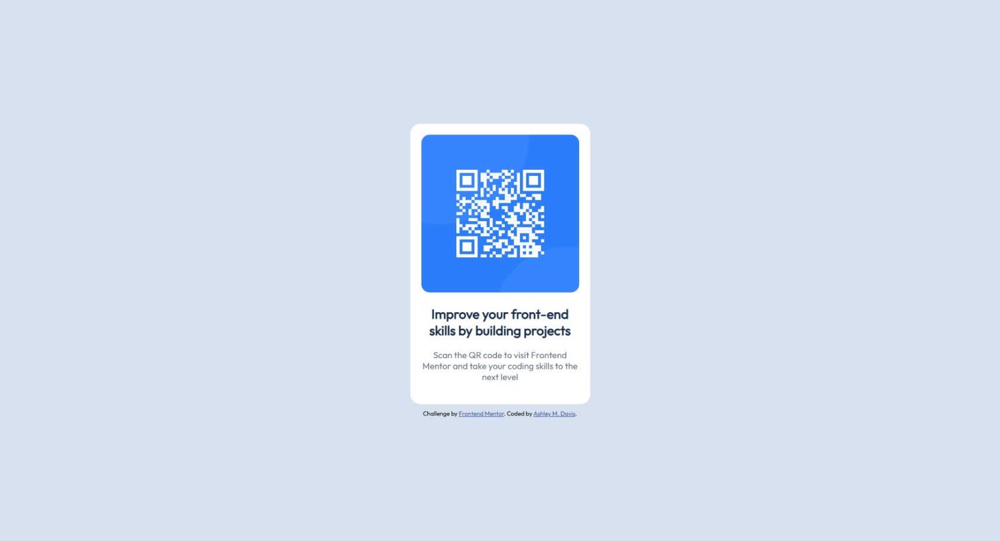

# Frontend Mentor - QR code component solution

This is a solution to the [QR code component challenge on Frontend Mentor](https://www.frontendmentor.io/challenges/qr-code-component-iux_sIO_H). Frontend Mentor challenges help you improve your coding skills by building realistic projects. 

## Table of contents

- [Overview](#overview)
  - [Screenshot](#screenshot)
  - [Links](#links)
- [My process](#my-process)
  - [Built with](#built-with)
  - [What I learned](#what-i-learned)
  - [Continued development](#continued-development)
- [Author](#author)

## Overview

### Screenshot

### Links

- Solution URL: [GitHub](https://github.com/ashmdavis/Frontend-Mentor---QR-code-component-solution/blob/main/index.html)

## My process

### Built with

- Semantic HTML5 markup
- CSS custom properties
- Flexbox

### What I learned

I learned the importance of organized HTML code and creating creating classes that can easily be located and grouped to help with the css process.

### Continued development

I would like to focus on flexbox and have a better understanding of what each element does and when best to use it.

## Author

- Website - [Ashley M. Davis](https://ashleymdavis.net/)
- Frontend Mentor - [@ashmdavis](https://www.frontendmentor.io/profile/ashmdavis)
- GitHub - [@ashmdavis](https://github.com/ashmdavis)
